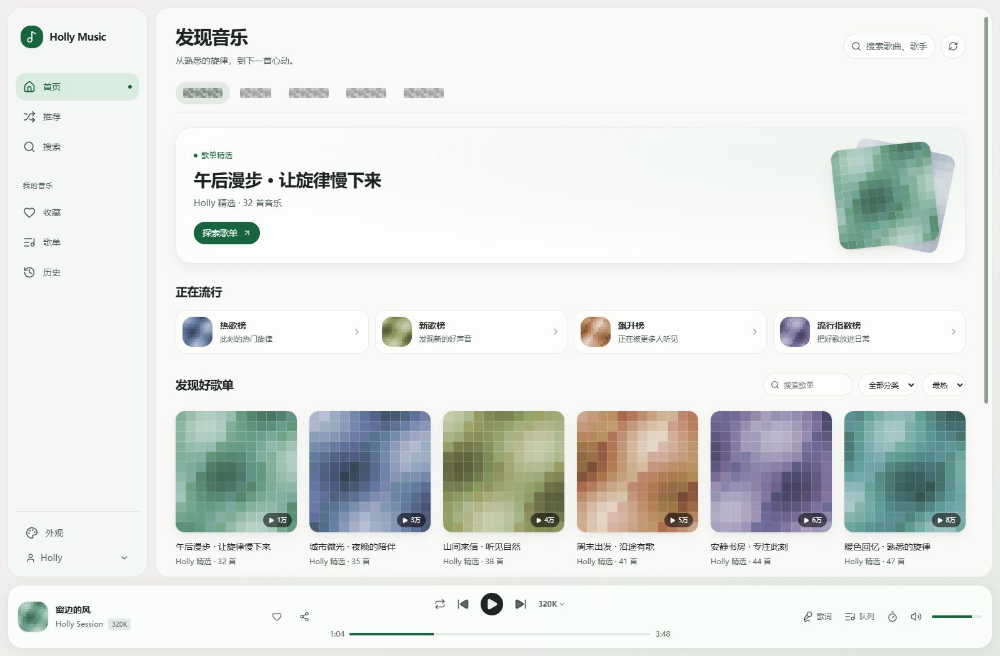
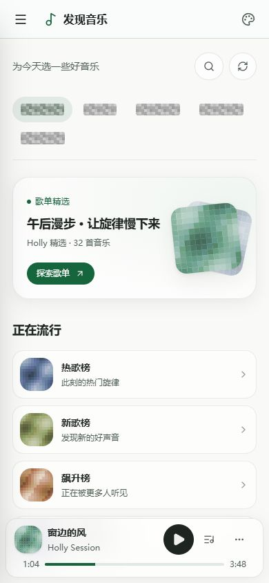
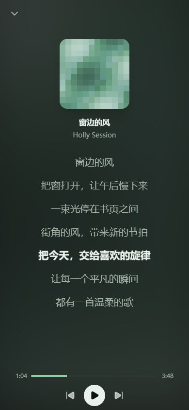

# Holly Music

**兼容洛雪音源的自托管音乐播放器。**

在电脑和手机上搜索、发现和收藏音乐，把歌单与听歌记录保存在自己的服务器。

[](https://github.com/redcatH/HollyMusic/releases) [](https://github.com/redcatH/HollyMusic/pkgs/container/hollymusic) [](LICENSE)

[快速部署](#快速部署) · [界面预览](#界面预览) · [使用文档](#使用文档) · [交流与贡献](#交流与贡献)

## 为什么选 Holly Music

- **复用已有音源**：导入 LX Music 自定义音源脚本，用一个搜索框检索多个平台。
- **带上自己的歌单**：导入网易云 CSV 或 QQ 公开歌单，继续整理熟悉的音乐。
- **电脑手机都好用**：响应式界面、深浅主题、沉浸歌词和 PWA，支持锁屏播放控制。
- **适合个人与家庭**：Docker 部署，多账号使用，收藏、歌单和听歌记录各自管理。

还支持 AI 协助建歌单、歌曲分享、下载、服务端音频缓存，以及 Subsonic 客户端接入。[查看完整功能 →](docs/USER-GUIDE.md)

## 界面预览

<p align="center">
  
</p>
<p align="center"><sub>桌面发现页 · 收藏、发现和播放在同一个空间</sub></p>

<p align="center">
  &nbsp;&nbsp;
  
</p>
<p align="center"><sub>手机发现与歌词 · 浅色与深色主题</sub></p>

截图来自当前界面，使用演示歌单与原创示例歌词；平台名称已打码，封面使用不含第三方标识的马赛克示意图。

## 快速部署

需要 Docker Compose、服务端可访问音源接口的网络，以及自行准备的 LX Music 自定义音源脚本。项目不附带音源脚本；发现内容可独立浏览，歌曲播放取决于已启用的音源。

### 1. 下载部署配置

首次部署在一个新目录中执行。以下命令适用于 Linux、macOS 或 WSL 的 Bash 终端：

```bash
mkdir holly-music
cd holly-music
curl -fsSL -o docker-compose.yml \
  https://raw.githubusercontent.com/redcatH/HollyMusic/main/docker-compose.example.yml
```

### 2. 生成密钥并启动

```bash
printf 'AUTH_SECRET=%s\n' "$(openssl rand -hex 32)" > .env
docker compose up -d
```

没有 OpenSSL 时，可按[部署指南](docs/DEPLOYMENT.md)手动创建 `.env`。默认音频缓存配额为 10GB，可在 `docker-compose.yml` 中调整。

### 3. 登录并导入音源

1. 打开 `http://localhost:3099`；远程部署请替换为服务器地址。
2. 执行 `docker compose logs app` 查看首次生成的 `admin` 密码，登录后按提示修改。
3. 通过侧栏底部账号菜单进入「系统管理 → 音源管理」，上传 `.js` 脚本或导入在线订阅链接。
4. 开始搜索播放；需要多人使用时，在「用户管理」中创建账号。

预置管理员、NAS/Windows 部署、HTTPS、持久化目录与源码构建方式见[完整部署指南](docs/DEPLOYMENT.md)。PWA 安装需要 HTTPS 或 localhost。

### 升级

在原部署目录执行；升级前备份用户数据，保留原 `.env` 与挂载目录：

```bash
docker compose pull
docker compose up -d
```

如需固定版本，将 Compose 中的 `:latest` 改为 [Releases](https://github.com/redcatH/HollyMusic/releases) 中的具体版本标签。

## 常见问题

**需要自己准备音源吗？** 需要。支持导入 LX Music 自定义音源；配置成功后可搜索和获取播放地址，实际可用性取决于脚本及上游服务。

**能导入哪些歌单？** 当前支持网易云 CSV 和 QQ 公开歌单链接/ID。网易云 CSV 可使用 [Music-Playlist-Exporter](https://github.com/redcatH/Music-Playlist-Exporter) 导出。[导入范围与要求](docs/USER-GUIDE.md#歌单导入)

**不配置 AI 也能用吗？** 可以。AI 建歌单和推荐任务需要单独配置 API，其余功能可正常使用。

**PWA 可以离线听歌吗？** 当前离线支持主要是打开应用界面，不等于已提供客户端离线歌曲下载。播放仍需要连接自部署服务。

## 使用文档

| 我想…… | 去这里 |
|---|---|
| 部署、升级、配置 HTTPS 或持久化目录 | [部署与升级](docs/DEPLOYMENT.md) |
| 配音源、导入歌单、使用 AI 和分享 | [功能与音源指南](docs/USER-GUIDE.md) |
| 接入 Subsonic 客户端或查看 API | [API 与 Subsonic](docs/API.md) |
| 备份数据、清理缓存、排查播放和登录问题 | [运维与排障](docs/OPERATIONS.md) |
| 从源码运行、了解架构、参与开发 | [本地开发](docs/DEVELOPMENT.md) · [贡献指南](CONTRIBUTING.md) |

前端采用 Vite + React，后端采用 Next.js API，数据存储使用 SQLite。更多实现细节见开发文档。

## 交流与贡献

QQ 群：**645630511**，用于使用交流、答疑和版本通知。[查看入群二维码](docs/img/530bce6d-fb5f-41b7-9ddb-46cc1f644814.png)

欢迎通过 [Issues](https://github.com/redcatH/HollyMusic/issues) 反馈问题或提交 PR。参与前请阅读[贡献指南](CONTRIBUTING.md)与[行为准则](CODE_OF_CONDUCT.md)。版本变化以 [Releases](https://github.com/redcatH/HollyMusic/releases) 为准。

## 许可与版权

本项目基于 [MIT License](LICENSE) 开源。

> 版权声明：本项目聚合的音源来自网络公开资源，音频版权归原始权利人所有。本项目仅供学习交流使用，不得用于商业目的。使用本项目产生的一切法律责任由使用者自行承担，请遵守当地版权法律法规。
